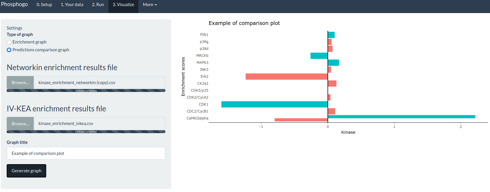

# What is phosphogo?
Phosphogo is a set of tools to analyze phosphoproteomic data from mouse and human experiments. Kinase-substrate predictions can be performed using NetworKIN and IV-KEA (in vitro kinase enrichment analysis) in a user-friendly interface. Analyzing phosphoproteomic data without knowing how to code is now posible thanks to Phosphogo!

# Phosphogo user interface
This user interface allows you to run the same tools than the command-line version of phosphogo. It requires the package `shiny`. From this application, you can install or reinstall phosphogo dependencies, input your phosphoproteomic data, generate predictions and visualize outputs.

# 0. Setup
You can install/reinstall phosphogo dependencies on this page. Phosphogo scans the folder from which the app is launched and will install NetworKIN and/or the IV-KEA database in this folder.
NetworKIN and the IV-KEA database will be downloaded and installed in the current folder.

# 1. Your input
### Import your data
This page allows you to import your data as a **.csv or .xlsx** table.

### Indicate the colums to use
The table should contain the following columns:
- The name of each phosphosite as `UniprotID-Phospho:Site` (*e.g* PCDH7-Phospho:S1011)
- Log2 of expression ratio between control and condition. Recommended formula is `log2(condition/control)`.
- Adjusted p-value

The section `Your data at a glance` will output the first lines of the uploaded table to help you select the right columns.

### Select the species
Indicate the species of origin of your data. Mouse data will be converted into human data for NetworKIN and IV-KEA using the [Phosphosite](https://www.phosphosite.org) orthology database.

### Indicate where outputs should be saved
Finally, select where to output phosphogo files. These files include pre-processing files, raw prediction outputs, graphs... Plots can still be generated using the `3. Visualize` tab of phosphogo.

# 2. Run
You can run either NetworKIN or IV-KEA.

### IV-KEA
*In vitro* kinase enrichment analysis relies on an *in vitro* database. This analysis is fast and relies on *in vitro* data but is restricted to 300 kinases. Find more details in [Sugiyama et al., 2019](https://www.nature.com/articles/s41598-019-46385-4).

### NetworKIN
NetworKIN is a predictive algorithm that uses published datasets and homology to predict kinase-subtrate relationship. For more details, see [Horn et al., 2014](http://www.nature.com/nmeth/journal/v11/n6/full/nmeth.2968.html).

#### Quality control
Phosphogo selects by default only the top 20% predictions according to their prediction score. Phosphogo will output the density of prediction scores as a quality control.

*NetworKIN can output hundreds of predictions per phosphosite, often with a low prediction score. Thus, a high density of low scores is expected in usual conditions.*

# 3. Visualize
You can visualize the results of kinase enrichment analysis. These results reveal kinases that are differentially predicted more/less often in your condition compared to control.
The generated graphs are interactive, their range and zoom can be changed and they can be saved thanks to the tools at the top right side of the graphs.

### Enrichment graph
The results of one enrichment analysis (either IV-KEA or NetworKIN) can be visualized in the form of an interactive volcano plot. The enrichment results files are outputted by default by phosphogo and start by `kinase_enrichment` (usually `kinase_enrichment_ivkea.csv` or `kinase_enrichment_networkin.csv`).

### Comparison graph
If you have run NetworKIN and IV-KEa on your dataset, you can easily compare the results of both algorithms in one plot thanks to this function. Just import the two kinase enrichment files and generate the graph.

*As NetworKIN and IV-KEA use two different annotation systems, some kinases are labelled with different names by the to algorithms.*

